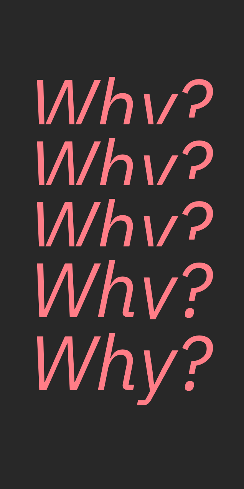
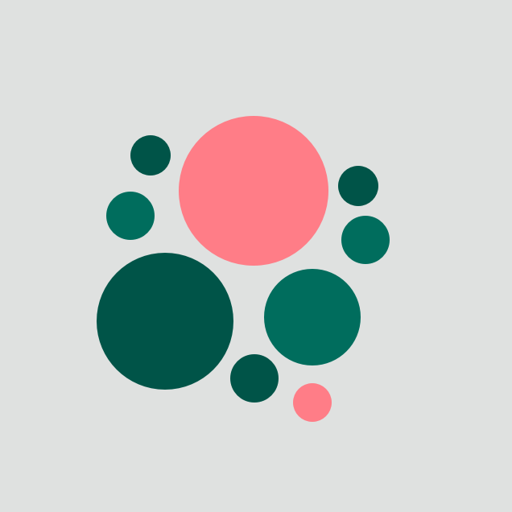
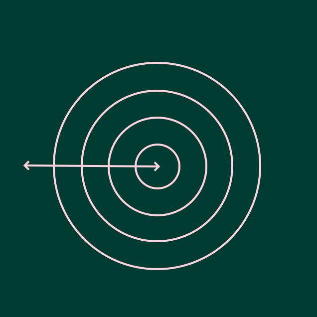

import HomepageTemplate from "gatsby-theme-carbon/src/templates/Homepage";
import HomepageNavTile from "../components/HomepageNavTile";
import "./index.scss";

export default HomepageTemplate;

<Row className={"getting-started bx--no-gutter hide-on-medium"}>
  <Column colMd={4} colLg={4} noGutterSm>
    <ImageCard
      className="card"
      title="Guiding principles"
      href="/guiding-principles/principles-overview"
      aspectRatio="1:2"
      hoverColor="dark"
      actionIcon="arrowRight"
      >

  </ImageCard>
</Column>

<Column colMd={4} colLg={4} noGutterSm>
    <ImageCard
      className="card"
      title="Research in practice"
      aspectRatio="1:1"
      href="/research-in-practice/practice-overview"
      hoverColor="dark"
      titleColor="dark"
      actionIcon="arrowRight"
      iconColor="dark">

  </ImageCard>
      <ImageCard
        className="card"
        title="Ethics and Responsibility"
        titleColor="light"
        aspectRatio="1:1"
        href="/ethics"
        actionIcon="arrowRight"
        hoverColor="dark">

  </ImageCard>
</Column>

<Column colMd={4} colLg={4} noGutterSm>
    <ImageCard
      className="card"
      title="Sponsor user program"
      aspectRatio="1:2"
      href="/sponsor-user-program/overview"
      titleColor="dark"
      actionIcon="arrowRight"
      hoverColor="dark">

  </ImageCard>
</Column>
</Row>

<Row className={"getting-started bx--no-gutter tablet"}>
  <Column colMd={4} colLg={4} noGutterSm>
    <ImageCard
      className="card"
      title="Guiding principles"
      href="/guiding-principles/principles-overview"
      aspectRatio="1:2"
      hoverColor="dark"
      actionIcon="arrowRight"
      >

  </ImageCard>

  <ImageCard
    className="card"
    title="Research in practice"
    aspectRatio="1:1"
    href="/research-in-practice/practice-overview"
    actionIcon="arrowRight"
    titleColor="dark"
    hoverColor="dark"
    iconColor="dark"
    >

  </ImageCard>

</Column>

<Column colMd={4} colLg={4} noGutterSm>
    <ImageCard
        className="card"
        title="Ethics and Responsibility"
        aspectRatio="1:1"
        href="/ethics"
        hoverColor="dark"
        titleColor="light"
        actionIcon="arrowRight">

</ImageCard>
    
<ImageCard
    className="card"
    title="Sponsor user program"
    titleColor="light"
    aspectRatio="1:2"
    href="/sponsor-user-program/overview"
    actionIcon="arrowRight"
    titleColor="dark"
    hoverColor="dark">

  </ImageCard>
</Column>
</Row>
